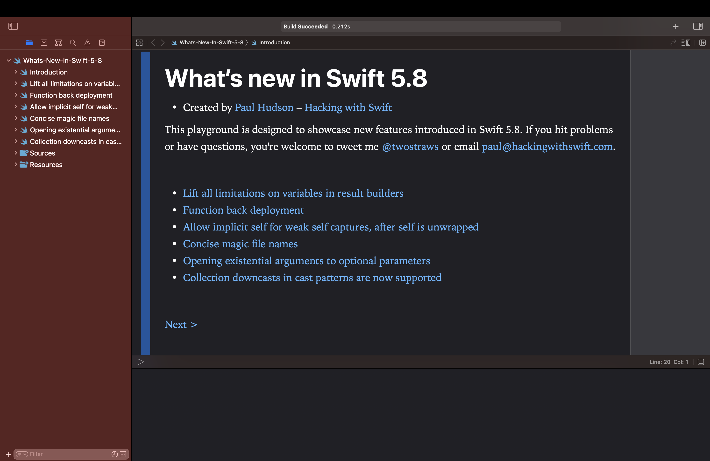

# What’s new in Swift 5.8?

This is an Xcode playground that demonstrates the new features introduced in Swift 5.8: 

* Lift all limitations on variables in result builders
* Function back deployment
* Allow implicit self for weak self captures, after self is unwrapped
* Concise magic file names
* Opening existential arguments to optional parameters
* Collection downcasts in cast patterns are now supported

This is designed to complement my existing article [What’s New in Swift 5.8](https://www.hackingwithswift.com/articles/256/whats-new-in-swift-5-8). You might also want to read previous articles about the evolution of Swift 5:

* [What’s New in Swift 5.7](https://www.hackingwithswift.com/articles/249/whats-new-in-swift-5-7)
* [What’s New in Swift 5.6](https://www.hackingwithswift.com/articles/247/whats-new-in-swift-5-6)
* [What’s New in Swift 5.5](https://www.hackingwithswift.com/articles/233/whats-new-in-swift-5-5)
* [What’s New in Swift 5.4](https://www.hackingwithswift.com/articles/228/whats-new-in-swift-5-4)
* [What’s New in Swift 5.3](https://www.hackingwithswift.com/articles/218/whats-new-in-swift-5-3)
* [What’s New in Swift 5.2](https://www.hackingwithswift.com/articles/212/whats-new-in-swift-5-2)
* [What’s New in Swift 5.1](https://www.hackingwithswift.com/articles/182/whats-new-in-swift-5-1)
* [What’s New in Swift 5.0](https://www.hackingwithswift.com/articles/126/whats-new-in-swift-5-0)

Alternatively, here you can find a complete breakdown of all Swift changes from 1.0 through 5.8, including downloadable playgrounds: [what's new in Swift](https://www.hackingwithswift.com/swift).

If you hit problems or have questions, you're welcome to tweet me [@twostraws](https://twitter.com/twostraws) or email <paul@hackingwithswift.com>.

